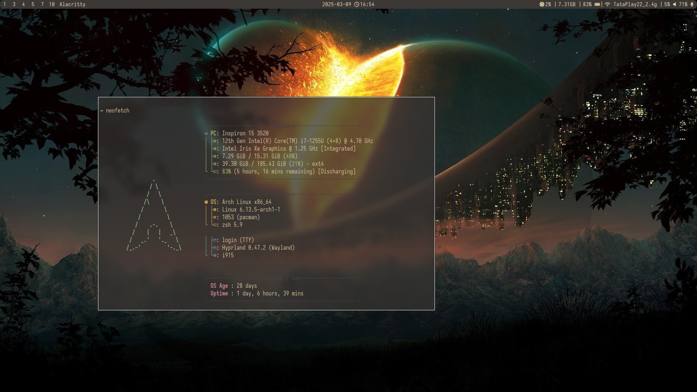
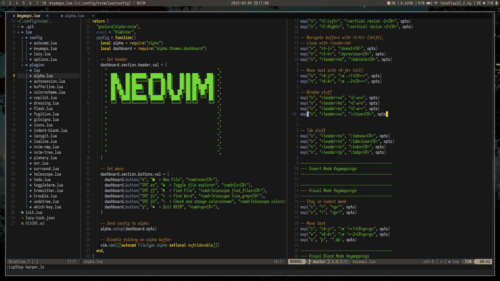

# Hyprland Config

- Personal hyprland config on arch (yes, I use arch btw)
- Includes config for hyprland, waybar, rofi, alacritty, hyprlock

# Screenshots:

* Contact: [suswanj](https://github.com/suswanj)
* License: [GPL-3.0](https://www.gnu.org/licenses/gpl-3.0.html)
